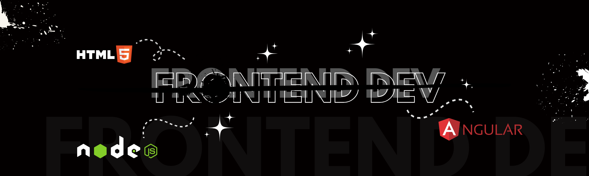

<h1>Hi 👋, I’m an Application Developer with 1+ year of frontend experience.</h1>

Crafting clean, responsive UIs with Angular, JavaScript, and a passion for seamless user experiences

## 🌐 Socials:

 

<h2>🚀 Languages and Tools I Use</h2>

# 📊 GitHub Stats:

 
 

<picture>
  <source media="(prefers-color-scheme: dark)" srcset="https://raw.githubusercontent.com/Zeologan/Zeologan/output/github-snake-dark.svg" />
  <source media="(prefers-color-scheme: light)" srcset="https://raw.githubusercontent.com/Zeologan/Zeologan/output/github-snake.svg" />
  
</picture>
